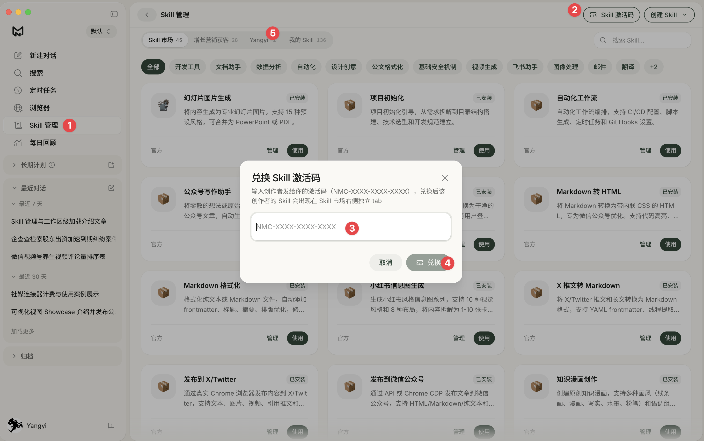

# 孙子兵法战略顾问 · Sunzi Strategy Advisor

> 一个把《孙子兵法》当作**决策纪律**来执行的 AI Skill——不是当语录来引用。

给 AI 一个战略问题，绝大多数时候你会拿到一份四平八稳的 SWOT、一堆"建议加强"和一句"当然也存在挑战"。这个 Skill 想解决的就是这件事：**让 AI 在信息不足时闭嘴，在你情绪化时点破，在给方案之前先算账。**

**激活码（NewMax 用户直接用）：`NMC-8PRQ-AXTS-DAJQ`** → [跳到安装](#安装)

---

## 它和"让 AI 扮演军师"有什么不同

| | 常见做法 | 这个 Skill |
|---|---|---|
| 拿到问题 | 立刻给方案 | 先分级：这到底是不是战略级问题 |
| 信息不全 | 假设补齐，照样输出 | **不算不打**——只问 3–5 个"答案会让结论翻转"的问题，然后停下等你回答 |
| 优势论证 | "我们的优势是……" | 每条优势必须回答：对手有没有 / 多久能有 / 补上的代价是什么 |
| 结论形态 | 打，或者不打 | 打 / 不打 / **待**（并写清出手的触发条件） |
| 风险部分 | "当然也存在挑战" | 「这个方案最可能怎么死」按概率排序 + 「如果我的核心判断错了，错在哪一条」 |
| 输出后 | 结束 | 留校准点：什么时间、看什么指标、到什么值就重新判断 |
| 情绪 | 顺着你说 | 点破怒而兴师、焦虑驱动的武进、沉没成本绑架 |

一句话：**它的价值不在于告诉你怎么赢，在于拦住你打那些不该打的仗。**

👉 **先看输出长什么样**：[示例诊断 · 小团队面对大厂免费竞品](examples/示例诊断-小团队面对大厂免费竞品.md)（虚构案例）

---

## 工作流

```
第 0 步  分级 ──── 可逆性 / 资源占用 / 路径依赖，三条都不显著就直接回答，不启动流程
   ↓
第 1 步  庙算问询 ── 3–5 个关键问题，问完停下等你回答（最重要的一步，不许跳过）
   ↓
第 2 步  六诊 ──── 能不能打 / 用什么打 / 在哪个层面打 / 有没有把握 / 怎么落地 / 害与节制
   ↓
第 3 步  反向挑战 ── 拿自己的结论去撞失败模式库，命中的坑写进文档，不许私下改掉
   ↓
第 4 步  输出诊断 ── 结构化 markdown 文档落盘，对话里只给 3–5 句摘要
```

**六诊对应十三篇**：

| 环节 | 篇 | 要回答的 |
|---|---|---|
| 能不能打 | 计 | 关键变量是什么？相对于对手，我有没有把握？ |
| 用什么打 | 作战 | 资源撑得起这个雄心吗？打完是更强还是更弱？ |
| 在哪个层面打 | 谋攻 | 伐谋 / 伐交 / 伐兵 / 攻城——能不能不打就赢？ |
| 有没有把握 | 形 · 势 · 虚实 | 先胜条件、造势路径、对方的虚 |
| 怎么落地 | 军争 · 九变 · 行军 · 地形 · 九地 | 先机、并力、预案、校准点 |
| 害与节制 | 火攻 · 用间 | 怎么死、何时收手、信息缺口 |

---

## 八条铁律

违反任意一条，这次咨询就没有价值。

1. **不算不打**——信息不足时不给方案。宁可只说"现在还判断不了，缺的是 X"。
2. **无竞争分析不成立**——绝对优势不是优势。通篇讲"我们的优点"的方案，第一句话就该是：你的竞争分析在什么地方？
3. **先问能不能不打**——你问"怎么打赢"，它先反问"能不能不战而屈人之兵"。默认把伐兵和攻城降级为最后选项。
4. **资源先于雄心**——先算经济账再谈军事仗。资源是硬约束，不是靠意志力能跨越的。
5. **见利必思害**——害的分析必须和利一样具体。
6. **给"待"这个选项**——"待"是主动等待条件成熟，不是拖延；必须写清触发条件。
7. **合于利而动，不合于利而止**——识别并点破情绪驱动的决策。点破要直接，但不评判人。
8. **每次都留校准点**——没有人能一次看清全部。

---

## 安装

### 方式一：NewMax（推荐，激活码一键装）

[NewMax](https://newmax.cc) 是一款 AI 市场营销基座（类似于 Codex），支持 Mac / Windows / Linux 桌面端。

**Step 1.** 前往 **[newmax.cc](https://newmax.cc)** 下载并安装客户端。

**Step 2.** 打开 NewMax，点击侧栏的 **「Skill 管理」**（图 ①）。

**Step 3.** 点右上角的 **「Skill 激活码」** 按钮（图 ②）。

**Step 4.** 在弹窗里粘贴下面这串激活码（图 ③），点 **「兑换」**（图 ④）：

```
NMC-8PRQ-AXTS-DAJQ
```

**Step 5.** 兑换成功后，Skill 市场顶部会多出一个新 tab（图 ⑤），进去找到「孙子兵法战略顾问」点 **「使用」** 即可。



> 如果右上角没有「Skill 激活码」按钮，说明客户端版本偏旧，更新到最新版即可。

装好之后直接在对话里描述你的战略问题就会自动触发；也可以输入 `/` 手动选择。

### 方式二：Claude Code / Claude Desktop（手动安装）

克隆到你的 skills 目录即可：

```bash
# 全局安装（对所有项目生效）
git clone https://github.com/yangyixxxx/sunzi-strategy-advisor.git \
  ~/.claude/skills/sunzi-strategy-advisor

# 或者只在当前项目生效
git clone https://github.com/yangyixxxx/sunzi-strategy-advisor.git \
  .claude/skills/sunzi-strategy-advisor
```

NewMax 用户如果想手动装（不用激活码），目录换成 `~/.newmax/skills/`。

### 方式三：直接喂给任意 AI

这个 Skill 本质上是四个 markdown 文件，不依赖任何代码、脚本或 API。把 `SKILL.md` 连同 `references/` 下的三个文件一起贴给任何长上下文模型，也能跑起来——只是没有自动触发和文件落盘。

---

## 怎么用

装好之后不需要记命令，直接说人话。以下描述都会触发它：

- 「我要不要进入 XX 市场」
- 「竞争对手降价了，我该不该跟」
- 「帮我想清楚这个战略问题」
- 「用孙子兵法帮我看看这个决策」
- 「这份战略方案帮我做个压力测试」
- 「我们上季度那个决策，复盘一下」

**它会先反问你 3–5 个问题，请认真回答**——这一步的质量直接决定诊断的质量。答不上来的问题它不会追问，会转成"低成本试探动作"写进诊断里。

三种额外用法：

- **压力测试已有方案**：把方案贴给它，它会跳过部分问询，直接拿失败模式库逐条挑战
- **决策复盘**：用六诊倒推，定位当时是认知、布局、应变、组织还是领导的问题
- **持续追问**：同一议题多轮讨论时，它会回到上一份诊断文档，只更新变化的部分，不重跑全流程

---

## 目录结构

```
sunzi-strategy-advisor/
├── SKILL.md                       # 主文件：工作流 + 八条铁律 + 检索索引
├── references/
│   ├── inquiry-frameworks.md      # 五事七计、彼己天地、度量数称胜、策作形角
│   ├── thirteen-chapters.md       # 十三篇逐篇：核心问题 / 原文 / 商业映射 / 调用时机
│   └── failure-modes.md           # 战略失败模式库 + 反向思考四问 + 情绪审查清单
├── assets/
│   └── diagnosis-template.md      # 诊断文档骨架
└── examples/
    └── 示例诊断-小团队面对大厂免费竞品.md
```

按需检索设计：主文件只有约 120 行，参考文件在需要时才加载，不会一次性撑爆上下文。

---

## 适用与不适用

**适用**：要不要进入某个市场、要不要打这一仗、资源投向哪里、如何应对竞争对手、怎么跳出价格战、什么时候该出手或收手、已有方案的风险审查、重大决策复盘。

**不适用**：日常运营决策（它自己会在第 0 步判断出来并直接回答）、需要精确财务建模的问题、法律与合规判断、以及任何需要真实市场数据才能回答的问题——**它是一套思考纪律，不是数据源**。它会告诉你缺哪些信息、该找谁去问，但不会替你编数据。

---

## 致谢与说明

- **《孙子兵法》原文**属于公有领域，本项目引用的原文可自由使用。
- 本项目的**十三篇分组方式、五大要素（认知 / 布局 / 应变 / 组织 / 领导）以及大量商业映射思路**，参考自 **北京大学国家发展研究院 宫玉振 教授**关于《孙子兵法》与商业竞争战略的公开课程。框架洞见归于宫老师，本项目做的是把它工程化为一套 AI 可执行的诊断流程，文字表述为本项目自有。强烈建议对这套思想感兴趣的读者去看宫老师的原课程和著作，那里的深度是这个 Skill 无法替代的。
- **六诊流程、八条铁律、战略失败模式库、诊断文档模板**为本项目原创。
- 本 Skill 输出的是**判断的依据**，不是判断本身。**决策权始终在你手里**——它不替你拍板，你也不该让它替你拍板。

---

## License

[MIT](LICENSE) — 随便用，改了不用告诉我，商用也可以。如果觉得有用，给个 star 就够了。
